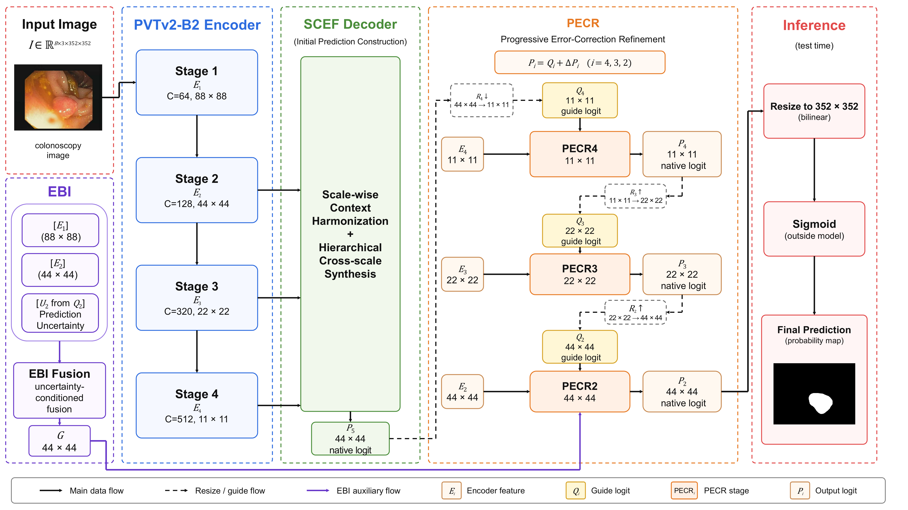

# EvoCorrNet

### Evolving Predictions through Error-Oriented Progressive Correction for Polyp Segmentation

Official PyTorch implementation of **EvoCorrNet: Evolving Predictions through Error-Oriented Progressive Correction for Polyp Segmentation**.

> 🚧 **Pre-release repository.** The source code and executable instructions are currently being prepared for release.

## Architecture

  

**Overall architecture of EvoCorrNet.** SCEF constructs the initial prediction from hierarchical encoder features, PECR progressively refines the inherited prediction across three correction stages, and EBI introduces shallow structural information at the final boundary-oriented refinement stage.

## Overview

EvoCorrNet formulates polyp segmentation as an evolving prediction process rather than repeatedly decoding independent segmentation masks. The network first establishes an initial semantic prediction from hierarchical encoder features and then preserves this prediction as an explicit state throughout subsequent decoding.

Subsequent stages progressively correct the inherited prediction according to the discrepancies that remain in the current estimate. Recovery-, suppression-, and boundary-oriented correction alternatives are constructed from the current prediction and aligned feature evidence, resolved through pixel-wise competition, and converted into residual updates. Shallow structural cues are introduced only at the final boundary-oriented stage.

## Key Components

### SCEF Decoder

SCEF coordinates heterogeneous deeper encoder representations before cross-scale interaction and constructs the initial prediction state. It performs scale-wise context harmonization followed by hierarchical cross-scale synthesis to produce the initial logit \(P_5\).

### PECR — Progressive Error-Correction Refinement

PECR preserves the inherited prediction and progressively updates it through residual correction. At each stage, recovery-, suppression-, and boundary-oriented correction alternatives are constructed from the current prediction and aligned encoder evidence, weighted through pixel-wise competition, and combined through signed correction.

### EBI — Edge-Boundary Injection

EBI introduces high-resolution shallow structural cues only at the final PECR stage. The shallow information is conditioned by the current semantic representation and prediction uncertainty and is supplied to the boundary-deviation branch of PECR2.

## Prediction Evolution

EvoCorrNet maintains a continuous prediction trajectory:

\[
P_5 \rightarrow P_4 \rightarrow P_3 \rightarrow P_2
\]

\(P_5\) is the initial prediction constructed by SCEF, while \(P_4\), \(P_3\), and \(P_2\) are progressively corrected prediction states produced by PECR.

## Main Results

The following results are equal-weight averages over the five public polyp segmentation benchmarks used in our experiments.

| Method | mDice ↑ | mIoU ↑ | Fmaxβ ↑ | Sα ↑ | Emax ↑ | MAE ↓ |
|---|---:|---:|---:|---:|---:|---:|
| EvoCorrNet | 0.8862 | 0.8252 | 0.9140 | 0.9194 | 0.9811 | 0.0142 |

## Datasets

| Dataset | Training | Testing |
|---|---:|---:|
| Kvasir-SEG | 900 | 100 |
| CVC-ClinicDB | 550 | 62 |
| CVC-300 | — | 60 |
| CVC-ColonDB | — | 380 |
| ETIS-LaribPolypDB | — | 196 |

The training set contains 1,450 images from Kvasir-SEG and CVC-ClinicDB. CVC-300, CVC-ColonDB, and ETIS-LaribPolypDB are used exclusively for testing.

## Experimental Protocol

- Framework: PyTorch
- Backbone: PVTv2-B2 with ImageNet-pretrained initialization
- Input size: 352 × 352
- Optimizer: Adam
- Batch size: 16
- Initial learning rate: \(5 \times 10^{-5}\)
- Training epochs: 200
- Learning-rate decay: ×0.1 every 50 epochs
- Multi-scale training: 256 × 256, 352 × 352, and 448 × 448
- Gradient clipping: [-0.5, 0.5]

## Installation

Coming soon.

## Training

Coming soon.

## Inference

Coming soon.

## Evaluation

Coming soon.
